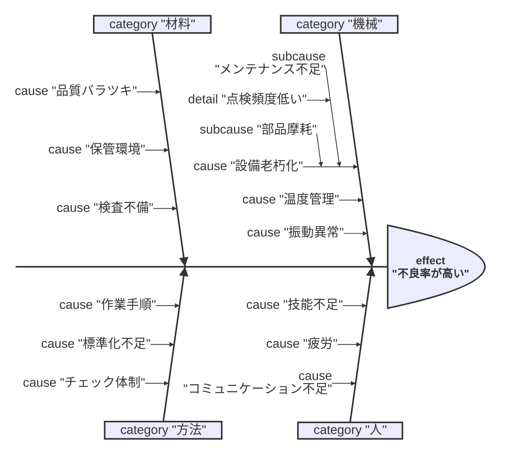

# 石川ダイアグラム（特性要因図）自動生成Webアプリ

Mermaidデータから正確で美しい特性要因図（Fishbone Diagram / Ishikawa Diagram）を自動生成するWebアプリケーションです。

## 特徴

- ✅ **正確な描画**: 教科書レベルの正統派石川ダイアグラム
- ✅ **Mermaid対応**: Mermaid形式のデータから自動生成
- ✅ **編集可能**: ラベルのドラッグ&ドロップ、矢印の調整が可能
- ✅ **4M対応**: 機械・人・材料・方法の4大骨を正確に配置
- ✅ **階層構造**: 大骨→中骨→小骨→孫骨の厳密な階層管理

## 使い方

1. `index.html` をブラウザで開く
2. Mermaidデータを入力エリアに貼り付け
3. 「生成」ボタンをクリック
4. 生成された図をドラッグ&ドロップで編集可能

## Mermaidデータ形式

## ファイル構成

- `index.html` - メインページ
- `style.css` - スタイルシート
- `mermaid-parser.js` - Mermaidパーサー
- `ishikawa-diagram.js` - ダイアグラム生成・編集エンジン

## 技術仕様

- SVGベースの描画（正確な座標制御）
- バニラJavaScript（依存ライブラリなし）
- レスポンシブデザイン

## ライセンス

MIT License
