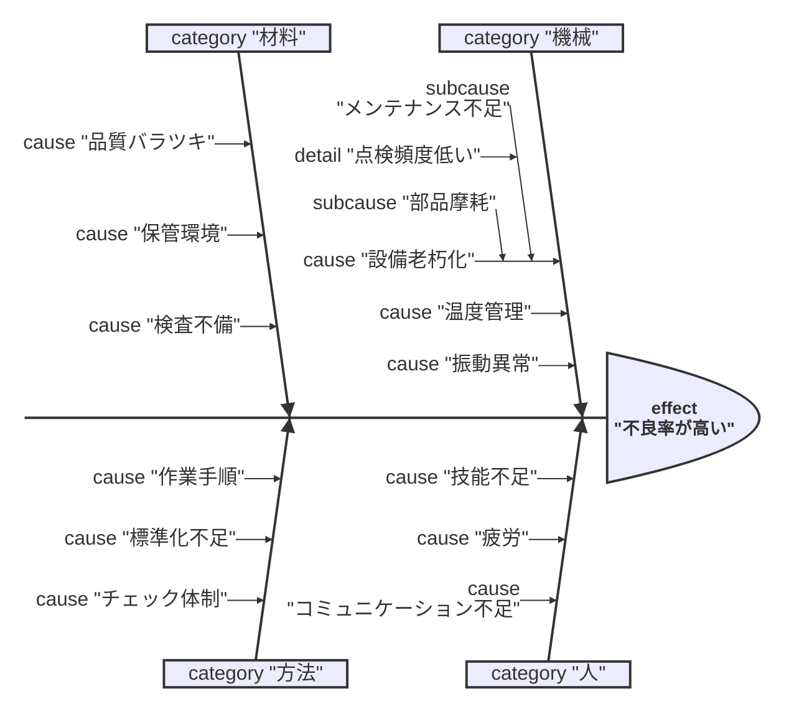
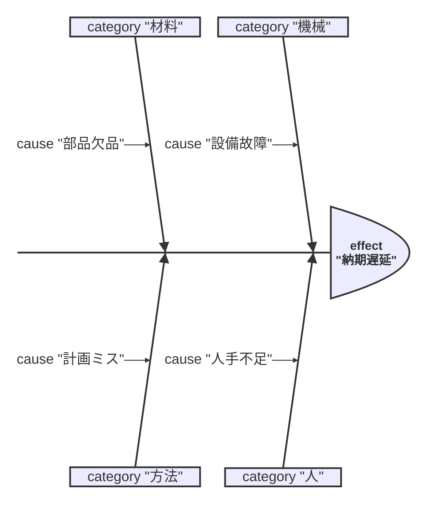
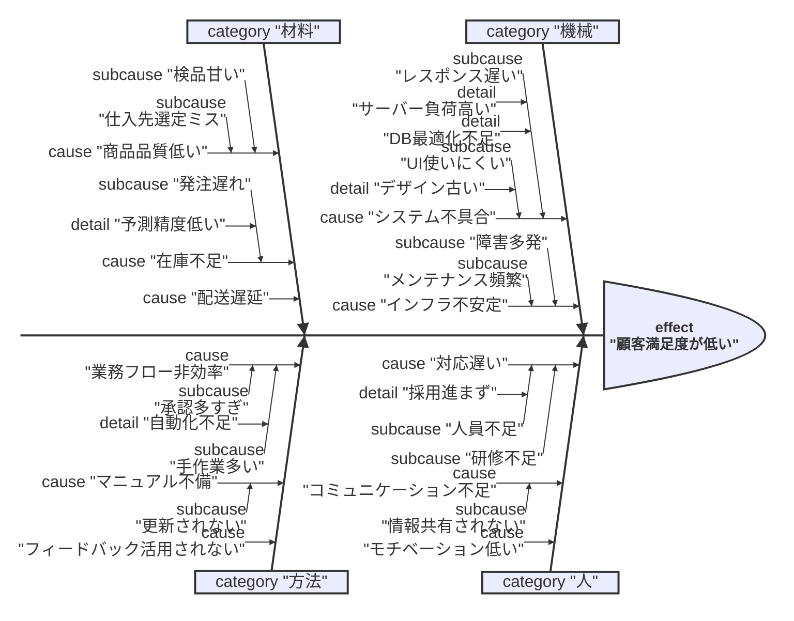

# 使用方法ガイド

## 基本的な使い方

### 1. アプリケーションを起動

`index.html` をブラウザで開きます。

```bash
# ローカルサーバーを起動（推奨）
python3 -m http.server 8000
# または
npx serve .
```

ブラウザで `http://localhost:8000` にアクセス。

### 2. Mermaidデータを入力

左側のテキストエリアにMermaid形式のデータを入力します。



### 3. ダイアグラムを生成

「ダイアグラムを生成」ボタンをクリックすると、右側に石川ダイアグラムが表示されます。

### 4. 編集

生成されたダイアグラムのラベルは、ドラッグ&ドロップで自由に移動できます。

### 5. エクスポート

- **PNG形式**: 画像ファイルとしてダウンロード
- **SVG形式**: ベクター形式でダウンロード

## データ構造

### 階層構造

```
ishikawa
  └─ effect (特性・問題)
      └─ category (カテゴリー・大骨)
          └─ cause (原因・中骨)
              └─ subcause (副原因・小骨)
                  └─ detail (詳細・孫骨)
```

### 要素の説明

| 要素 | 説明 | 例 | 最大数 |
|------|------|-----|--------|
| `effect` | 特性（解決したい問題） | "不良率が高い" | 1つ |
| `category` | カテゴリー（4M） | "機械", "人", "材料", "方法" | 4つ |
| `cause` | 原因（中骨） | "設備老朽化" | 各カテゴリー3つまで |
| `subcause` | 副原因（小骨） | "メンテナンス不足" | 各原因2つまで |
| `detail` | 詳細（孫骨） | "点検頻度低い" | 各副原因2つまで |

## 4Mとは

品質管理で使われる4つの要因カテゴリー:

1. **機械（Machine）**: 設備、機器、ツールに関する要因
2. **人（Man）**: 作業者のスキル、経験、意識に関する要因
3. **材料（Material）**: 原材料、部品、資材に関する要因
4. **方法（Method）**: 作業手順、プロセス、ルールに関する要因

## キーボードショートカット

- `Ctrl + Enter` (または `Cmd + Enter`): ダイアグラムを生成

## サンプルデータ

### シンプルな例



### 複雑な例



## トラブルシューティング

### ダイアグラムが表示されない

1. ブラウザのコンソールでエラーを確認
2. Mermaidデータの形式が正しいか確認
3. 引用符（`"`）が正しく閉じられているか確認

### ラベルが重なる

ドラッグ&ドロップで位置を調整してください。

### エクスポートできない

1. ダイアグラムが生成されているか確認
2. ブラウザがCanvas API、Blob APIをサポートしているか確認

## 技術仕様

- **SVG**: ベクター形式で描画、拡大縮小しても綺麗
- **ドラッグ&ドロップ**: SVGのtransform属性を使用
- **エクスポート**: Canvas APIでPNG変換、Blob APIでダウンロード

## ブラウザ対応

- Chrome/Edge: 完全対応
- Firefox: 完全対応
- Safari: 完全対応
- IE11: 非対応

## 開発

### ファイル構成

```
.
├── index.html              # メインHTML
├── style.css               # スタイルシート
├── mermaid-parser.js       # Mermaidパーサー
├── ishikawa-diagram.js     # ダイアグラム描画エンジン
├── README.md               # プロジェクト概要
└── USAGE.md                # このファイル
```

### カスタマイズ

`ishikawa-diagram.js` の `config` オブジェクトで、サイズ、色、フォントなどをカスタマイズできます。

```javascript
this.config = {
  width: 1400,              // SVG幅
  height: 900,              // SVG高さ
  spine: {
    strokeWidth: 4,         // 背骨の太さ
    color: '#2c3e50'        // 背骨の色
  },
  // ... 他の設定
};
```

## ライセンス

MIT License
